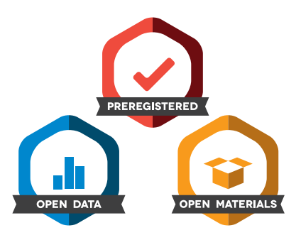

This is the [OSIG](https://osf.io/2dfhz/wiki/home/) project for issuing [Center for Open Science](https://centerforopenscience.org/) badges for Open Data and Open Materials for display on conference presentations and poster 

The aim of the project is to recognise archaeologists' efforts to improve scholarly communication in archaeology by making their data, code and other research products openly available. 

## What are these badges?

A badge is a small icon that you display on your conference poster, on your presentation slides, or your paper preprint to communicate that your data (e.g. spreadsheets) and materials (e.g. programming code) are openly available for anyone to access. When you give a talk or present a poster at a conference or meeting, you can point to the badges and tell the audience that your data and materials are openly available.

We have one badge to signify open data, and another for open materials. There are circumstances when data sharing is not possible, for example, sharing some human participant data could violate confidentiality. In those cases, the work may still be eligible for the open materials badge, if the analysis code, etc. are openly available. 

## Why should I get a badge?

By displaying a badge on your work, you signal that you value transparency of methods (e.g. scripts of R, Python, Matlab, etc.) and data (e.g. CSV, NetCDF, FITS, HDF5, FASTQ, image, etc. files), which are core values of science.  The specifications for earning a badge help you to learn simple guidelines for effective sharing of data and materials.  

Signalling that you value openness will help to shift the expected norms of behaviour in science. Currently there are few incentives that encourage researchers to make their data and materials easily available to others. Badges to recognize sharing can help to incentivize openness and make exchanging research information more efficient. [Empirical analysis](http://journals.plos.org/plosbiology/article?id=10.1371/journal.pbio.1002456) indicates that the use of badges by journals can increase sharing by up to an order of magnitude or more. 

## How do I get a badge? 

1. Prepare your poster/slides/paper as you usually do, but making sure that your text includes a **disclosure statement** ([what is this?](#disclosure_statement)) about your code and/or data ([where to archive the code/data?](#Where_can_I_archive_my_data_and_materials?)).
2. **Email** a PDF of your poster/slides/paper, or a URL to it, to `bmarwick@uw.edu`, **upload** it to a new issue on our [submissions](https://github.com/saa-osig/badges-for-open-practices/issues/new) repository , or **share the URL** of your file with us in a new issues on our [submissions](https://github.com/saa-osig/badges-for-open-practices/issues/new) page.
3. The editor will assign **two reviewers** to your submission. They will use the COS' [disclosure](https://osf.io/tvyxz/wiki/2.%20Awarding%20Badges/) review process, This means that they only confirm that the provided link(s) in the poster/slides/paper lead to the data and/or materials on a public, open access repository, and that the linked materials are related to the report. The reviewers will not attempt to run your code or reproduce your results. 
4. The **reviews will be published anonymously** on a GitHub repository dedicated to your submission. If they both recommend that the badge(s) be awarded, then the editor will create a persistent, public archive from the repository that contains your submitted poster/slides/paper and its reviews. If the reviews recommend revisions,  you may submit a revised copy, if you wish.
5. You will **receive a badge image file to add to your poster/slides/paper**. Your badge will include a DOI that links to the archive that contains the evidence of your badge review. This means that your badge is unique to the specific item that you submitted for review. You then add the badge image to your poster/slides/paper, and present or submit it as usual. You may make minor changes to your poster/slides/paper after you receive the badge, but you cannot remove the disclosure statement.

## What is a disclosure statement? 

The qualify for the badges, your poster/slides/paper must include a **disclosure statement**. The [Center for Open Science](https://osf.io/tvyxz/wiki/2.%20Awarding%20Badges/) require two items in this statement.

For the Open Data badge:

1. Provide the URL, DOI, or other permanent path for accessing the data in a public, open access repository.
2. State whether or not there are sufficient information accompanying your data for an independent researcher to reproduce the reported results? If no, explain.

For the Open Materials badge:

1. Provide the URL, DOI, or other permanent path for accessing the materials (e.g. code files, details of reagents, equipment, biological materials) in a public, open access repository.
2. State whether or not there are sufficient information for an independent researcher to reproduce the reported methodology? If no, explain.

Here is an example of a typical simple disclosure statement:

>The raw data and R code used to generate the results presented here can be downloaded from https://dx.doi.org/10.6084/m9.figshare.2065602. That repository contains all the information for an independent researcher to reproduce the methods and results reported here.

## What counts as data and materials?

There are three criteria for your data to count as **open data**:

1. Digitally-shareable data (are publicly available on an open-access repository. The data must have a persistent identifier and be provided in a format that is time-stamped, immutable, and permanent (e.g., files in a [university repository](https://researchworks.lib.washington.edu/index.html), on the Open Science Framework, or an independent repository listed at [*Nature*](http://www.nature.com/sdata/policies/repositories) or [re3data](http://www.re3data.org).
2. A data dictionary (for example, a codebook or metadata describing the data) is included with sufficient description for an independent researcher to reproduce the reported analyses and results. Data from the same project that are not needed to reproduce the reported results can be kept private without losing eligibility for the Open Data Badge.
3. An open license allowing others to copy, distribute, and make use of the data while allowing the licensor to retain credit and copyright as applicable. Creative Commons has defined several licenses for this purpose, which are described at http://www.creativecommons.org/licenses. CC0 or CC-BY is strongly recommended.

Similarly, there are three criteria for your materials to count as **open materials**:

1. Digitally-shareable materials are publicly available on an open-access repository. The materials must have a persistent identifier and be provided in a format that is time-stamped, immutable, and permanent (e.g., files in a [university repository](https://researchworks.lib.washington.edu/index.html), on the Open Science Framework, or an independent repository listed listed at [*Nature*](http://www.nature.com/sdata/policies/repositories) or [re3data](http://www.re3data.org)
2. Infrastructure, equipment, biological materials, or other components that cannot be shared digitally are described in sufficient detail for an independent researcher to understand how to reproduce the procedure.
3. Sufficient explanation for an independent researcher to understand how the materials relate to the reported methodology.

## Who can submit?

Currently we provide this service to all archaeologists. Submissions are welcome for any conference presentation, you do not need to have any connection with the Society of American Archaeology. Submissions from researchers in other fields will be considered on a case-by-case basis. 

## Where can I archive my data and materials?

Your data and materials must be publicly available on an open-access repository. The data must have a persistent identifier and be provided in a format that is time-stamped, immutable, and permanent. For example, a GitHub link to your code and data is not suitable because it is not persistent. Instead, you should archive your data and code from Github on a trustworthy repository that provides a persistent identifier.

A persistent identifier is a link to your files that will continue to work even if your files move to other servers or even to other organisations. There are several mature systems in common use: the persistent URL (PURL); the digital object identifier (DOI), and the Archival Resource Key (ARK). These are usually easy to recognise because the link contains the abbreviation of the system name (e.g. DOI in http://dx.doi.org/0.17605/OSF.IO/RTZTH). 

There are many open-access repositories that can provide time-stamped, immutable, and permanent storage of your files. Many repositories are discipline-specific, so one way to choose your repository is to see what other researchers in your field are using to store data and materials, and deposit your files there. Lists of repositories organised by subject are available at [re3data.org](http://service.re3data.org/browse/by-subject/) and [*Nature*](http://www.nature.com/sdata/policies/repositories). 

Another option are general-purpose repositories. For example, researchers at the University of Washington have the [ResearchWorks](https://researchworks.lib.washington.edu/) data repository, and UW library staff are available to help with depositing files. Other general-purpose repositories include the [Open Science Framework](https://osf.io/), [Figshare](http://figshare.com), and [Zenodo](https://zenodo.org/). These three services have convienent tools for easily moving files from GitHub into the repository 

## Where can I read more about this?

### Studies of the benefits of being open

Kidwell, Mallory C., et al. 2016 Badges to Acknowledge Open Practices: A Simple, Low-Cost, Effective Method for Increasing Transparency. PLOS Biology 14(5):e1002456.

McKiernan, Erin C., et al. 2016 How open science helps researchers succeed. eLife 5:e16800.

### Studies revealing the problems of the status quo with data and materials sharing

Joppa, Lucas N., et al. 2013 Troubling Trends in Scientific Software Use. Science 340(6134):814

Mislan, K. A. S., Jeffrey M. Heer, and Ethan P. White 2016 Elevating The Status of Code in Ecology. Trends in Ecology & Evolution 31(1):4-7.

Savage, Caroline J., and Andrew J. Vickers 2009 Empirical Study of Data Sharing by Authors Publishing in PLoS Journals. PLOS ONE 4(9):e7078.

Vines, Timothy H, et al. The Availability of Research Data Declines Rapidly with Article Age. Current Biology 24(1):94-97.

Wicherts, Jelte M, et al. 2006 The poor availability of psychological research data for reanalysis. American Psychologist 61(7):726.

### Guides for best practices with open data and open methods

Hampton, Stephanie E, et al. 2015 The tao of open science for ecology. Ecosphere 6(7):1-13.

LeVeque, Randall J., Ian M. Mitchell, and Victoria Stodden 2012 Reproducible Research for Scientific Computing: Tools and Strategies for Changing the Culture. Computing in Science and Engineering 14(4):13-17.

Nosek, B. A., et al. 2015 Promoting an open research culture. Science 348(6242):1422.

Wilson, G., Bryan, J., Cranston, K., Kitzes, J., Nederbragt, L., Teal, T.K., 2016. Good Enough Practices in Scientific Computing, CoRR abs/1609.00037.

Wilson, Greg, et al. 2014 Best Practices for Scientific Computing. PLoS Biol 12(1).

[PLOS Data Availability Policy](http://journals.plos.org/plosone/s/data-availability#loc-acceptable-data-sharing-methods)

[Springer Research Nature Data Policies](http://www.springernature.com/gp/group/data-policy/faq)

Justin Kitzes, Daniel Turek, Fatma Deniz (Eds.) [The Practice of Reproducible Research. Case Studies and Lessons from the Data-Intensive Sciences](https://www.practicereproducibleresearch.org/)

### Guides for preparing good posters/presentations/papers

#### Posters

Erren, T. C., & Bourne, P. E. (2007). Ten simple rules for a good poster presentation. PLoS computational biology, 3(5), e102. 

Boullata, J. I., & Mancuso, C. E. (2007). A “how-to” guide in preparing abstracts and poster presentations. Nutrition in Clinical Practice, 22(6), 641-646. 

Hamilton, C. W. (2008). At a Glance: A Stepwise Approach to Successful Poster Presentations. CHEST Journal, 134(2), 457-459. 

Rowe, N., & Ilic, D. (2011). Poster Presentation–a visual medium for academic and scientific meetings. Paediatric respiratory reviews, 12(3), 208-213. 

#### Presentations

Alley, M. (1996). The craft of scientific presentations. Springer.

Alley, M., & Neeley, K. A. (2005). Rethinking the design of presentation slides: A case for sentence headlines and visual evidence. Technical communication,52(4), 417-426.

Powell, K. 2005 Make your point. Nature 434, 416-417 (17 March 2005) | doi:10.1038/nj7031-416a 

Bourne PE (2007) Ten simple rules for making good oral presentations. PLoS Comput Biol 3(4): e77. doi:10.1371/journal.pcbi.0030077 

#### Papers

Neill, U. S. (2007). "How to write a scientific masterpiece." The Journal of Clinical Investigation 117(12): 3599-3602.

Provenzale, J. M. 2007. Ten Principles to Improve the Likelihood of Publication of a Scientific Manuscript. American Journal of Roentgenology 188(5): 1179-1182.

Gopen, George D. and Judith A. Swan 1990 The Science of Scientific Writing. American Scientist 78:550-558.

Kalpakjian, C. and M. Meade 2008. Writing Manuscripts for Peer Review: Your Guide to Not Annoying Reviewers and Increasing Your Chances of Success. Sexuality and Disability 26(4): 229-240.

Hengl, T. and  M Gould (2002) Rules of thumb for writing research articles 

Sand‐Jensen, K. (2007). How to write consistently boring scientific literature.Oikos, 116(5), 723-727.

Whitesides, G. M. (2004). Whitesides' group: writing a paper. Advanced Materials, 16(15), 1375-1377.

Gustavii B. How to write and illustrate a scientific paper. New York: Cambridge University Press

Day, Robert A. (1989) How to write and publish a scientific paper. Greenwood Press 

Wells, W. A. (2004). Me write pretty one day how to write a good scientific paper. The Journal of cell biology, 165(6), 757-758. 

### Still have questions?

Send them to Ben Marwick at `bmarwick@uw.edu`

### Editorial Board for the OSIG Badges Project

- Liying Wang `liying15@uw.edu`

- Matthew Harris `matthew.d.harris@aecom.com`

- You! Please make a pull request to add your name!
